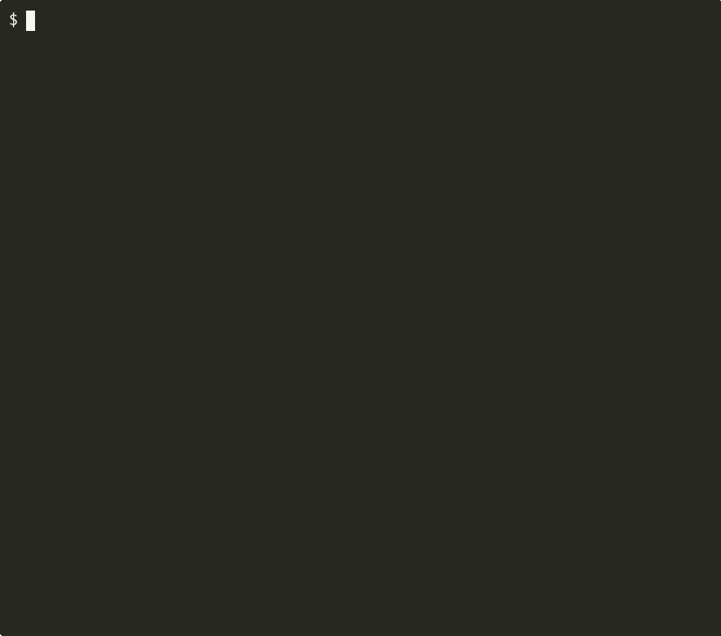

## arcam


Fast sandboxed development container manager using podman, minimal permissions by default choose balance between security and convenience



**NOTE: Version 0.1.X is considered alpha, breaking changes may happen at any point**

Arcam started as a bash script and has evolved a lot since then, all code since `v0.1.1` was written inside arcam container

*Originally named `box`*

### Features
- Sandboxed ephemeral container by default (podman defaults)
- Pass through audio, wayland, ssh-agent easily on demand with flags or config
- TOML configuration files for containers, customize your experience per project requirements
- Override dotfiles locally, so you don't have to rebuild the image to update dotfiles
- Automatic passwordless sudo *(or `su` if not installed)*
- Consistant development environment on any distro, especially useful on distros like fedora atomic
- Offline use, container initialization process does not require internet connection *(image has to be downloaded of course)*

### Installation
You can download binary for latest release [here](https://github.com/sandorex/arcam/releases/latest/download/arcam)

Alternatively you can install it from crates.io
```sh
cargo install arcam
```

You can also install straight from git
```
cargo install --git https://github.com/sandorex/arcam
```

### Usage
To avoid out-of-date documentation use the help text from binary itself\
For help with config options run `arcam config --options`, or to see an example `arcam config --example`

### Custom Container Image
Making a custom container image is same as for any other container, to take full advantage of arcam keep following things in mind:
- Install `sudo` for nicer experience
- Any executable files in `/init.d` will be executed on start of the container as the user, you can use `sudo` or `su` for root access
- Put dotfiles in `/etc/skel` which will be copied to user home on start, note that it may be overriden at runtime using `--skel`
- All data inside the container (not counting volumes) will be deleted when container stops, to add caching or presistant data use a named volume

For examples you can take a look at [my container](https://github.com/sandorex/config/tree/master/boxes) with neovim and all LSPs preinstalled

### Comparison to Other Tools
#### Toolbox / Distrobox
Both are great at their job, to provide a seamless integration with the host but not sandboxing

Arcam provides sandboxed experience by default, and it's your job to choose where/when to sacrifice security for convenience, it's highly configurable

### Development Notes
#### Demo GIF
Use asciinema in 80x30 terminal

The GIF was generated with following command
```
agg --theme monokai \
    --font-family 'FiraCode Nerd Font' \
    --font-size 16 \
    --last-frame-duration 5 \
    demo.cast demo.gif
```
